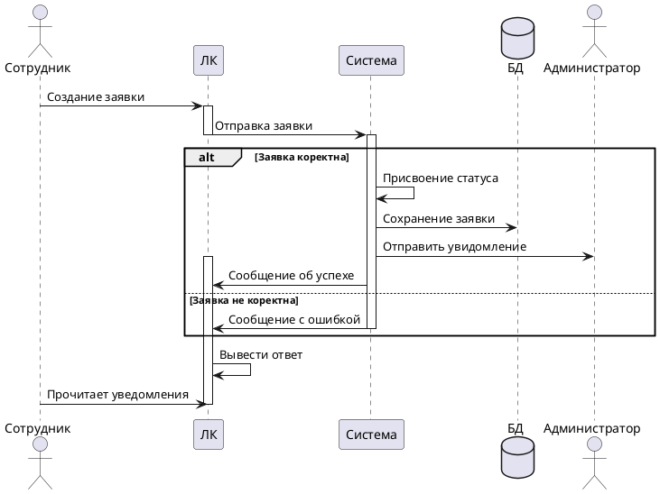

## Sequence diagram

### Цель диаграммы

"Диаграмма последовательности отображает взаимодействие между участниками системы и компонентами для выполнения бизнес-процесса."

### Участники

1. **Актор 1 (Название)**: Описание роли в процессе.  
2. **Участник 1 (Название)**: Функциональность в процессе.  
3. **База данных**: Для хранения и обработки данных. 