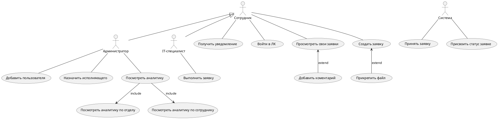

## Use Case

### Цель диаграммы

"Демонстрация взаимодействий между участниками системы и основными сценариями использования."

### Участники

1. **Название роли 1**: Краткое описание.  
2. **Название роли 2**: Краткое описание.  

### Основные сценарии

- **Название сценария 1**: Описание цели сценария.  
- **Название сценария 2**: Описание цели сценария.  

### Связи между сценариями

- **Extend:** Поясните, какие сценарии расширяются.  
- **Include:** Укажите, какие сценарии включаются в другие.  
